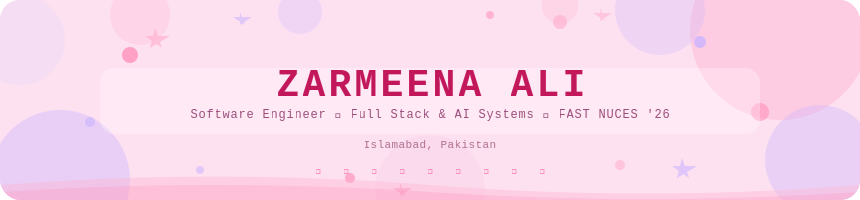

<div align="center">



<br/>

[](https://www.linkedin.com/in/zarmeena-fatima-732570267/)
[](https://github.com/notm33na)
[](mailto:zarmeenafatimaali@gmail.com)
[](https://arxiv.org/abs/2603.07500)

<br/>


</div>

---

## ✦ about me

```
hey! i'm zarmeena — a final-year SE student who builds things that actually work in production.
i've shipped healthcare platforms, financial forecasting tools, and microservices that handle real load.

i write Python + TypeScript for breakfast, deploy on Kubernetes for fun,
and once co-authored a research paper on high-dimensional time series forecasting just to see what would happen.

currently: surviving my FYP and adding too many features to everything.
```

---

## ✦ skills

**◈ languages**


**◈ frontend**


**◈ backend & ai**


**◈ devops & cloud**


**◈ databases**


---

## ✦ featured projects

<table>
<tr>
<td width="50%" valign="top">

**◈ Tabeeb**
> *AI-powered bilingual healthcare platform (FYP)*

HIPAA-aligned microservices · AES-256-GCM encryption · RAG medical chatbot (LangChain + GPT-4 + Pinecone) · bilingual OCR API · GRU sentiment classifier with sub-100ms inference · Whisper ASR · deployed on Oracle Cloud


</td>
<td width="50%" valign="top">

**◈ ForecastPro**
> *Web-based financial forecasting platform*

ARIMA, LSTM, GRU, Transformer & ensemble models · stocks, forex & crypto · FastAPI backend with model registry + retraining API · React + TypeScript dashboard with portfolio backtesting · deployed on Vercel


</td>
</tr>
<tr>
<td width="50%" valign="top">

**◈ Sudoku-Ultra**
> *Android app with AI assistance across 4 microservices*

CNN, RAG, Random Forest, K-Means on Kubernetes via ArgoCD · Kafka→DuckDB streaming · MLflow registry · 15-job CI/CD with OWASP ZAP + k6 load testing to 10k users


</td>
<td width="50%" valign="top">

**◈ E2EE Secure Messaging**
> *End-to-end encrypted messaging & file sharing*

AES-256-GCM encryption · ECDH authenticated key exchange · forward secrecy · MITM and replay attack protection · educational attack simulation tools


</td>
</tr>
</table>

---

## ✦ research

> **Enhanced Random Subspace Local Projections for High-Dimensional Time Series Analysis**
>
> Zarmeena Ali et al. · FAST NUCES · Supervised by Dr. Mirza Omer Beg · March 2026
>
> **33%** reduction in estimator variability at longer horizons · **14%** narrower confidence intervals on FRED-MD (126 predictors)
>
> [](https://arxiv.org/abs/2603.07500)

---

## ✦ experience

<table>
<tr>
<th>Role</th>
<th>Company</th>
<th>Period</th>
</tr>
<tr>
<td>🩷 Lab Demonstrator · Computer Networks</td>
<td>FAST NUCES</td>
<td>Fall 2025</td>
</tr>
<tr>
<td>🩷 NLP Intern</td>
<td>Decimal Solutions</td>
<td>Jul – Aug 2025</td>
</tr>
<tr>
<td>🩷 Web Development Intern</td>
<td>Stelalliance</td>
<td>Jul – Aug 2024</td>
</tr>
<tr>
<td>🩷 UI/UX Intern</td>
<td>Educatify</td>
<td>Jul – Aug 2024</td>
</tr>
</table>

---

## ✦ achievements

<table>
<tr>
<td><b>◈ ICPC Regional 2026</b></td>
<td>Qualified for preliminary round — one of the only mixed-gender teams to advance, and the only team with 2 female members to qualify</td>
</tr>
<tr>
<td><b>◈ AWS Certified</b></td>
<td>AWS Cloud Practitioner Essentials</td>
</tr>
<tr>
<td><b>◈ Google Certified</b></td>
<td>Google UX Design Professional Certificate</td>
</tr>
<tr>
<td><b>◈ Salesforce</b></td>
<td>Salesforce CRM Badge</td>
</tr>
</table>

---

## ✦ stats & activity

<div align="center">

[](https://git.io/streak-stats)

<br/>


</div>

---

## ✦ most used languages

<div align="center">


</div>

---

<div align="center">

<svg width="100%" viewBox="0 0 860 80" xmlns="http://www.w3.org/2000/svg">
  <defs><clipPath id="roundf"><rect width="860" height="80" rx="14"/></clipPath></defs>
  <g clip-path="url(#roundf)">
    <rect width="860" height="80" fill="#FFD6E8"/>
    <circle cx="0" cy="0" r="80" fill="#FFB3D1" opacity="0.3"/>
    <circle cx="860" cy="80" r="80" fill="#C9B3FF" opacity="0.3"/>
    <text x="430" y="36" font-family="monospace" font-size="12" fill="#9B4D7A" text-anchor="middle">✦ Made with too much caffeine · FAST NUCES · Islamabad · 2026 ✦</text>
    
  </g>
</svg>


</div>
